# 🩺 AI Medical Consultation Platform

<!-- Project Introduction -->
This project is a full-stack web application for **AI-powered medical consultations**. It allows patients to access virtual consultations, medical records, community health centers, and more, with strong security.

---

## 🚀 Features Overview

<!-- Features list -->
### ✅ Patient & Doctor Features
- AI symptom analysis with diagnosis suggestions
- Video consultation via secure video calls
- Appointment booking and management
- Secure user profile management (Patients & Doctors)
- Community health center directory
- Personalized medical follow-ups
- Prescription download
- Lab analysis management
- Admin panel for managing users and services
- Robust security and confidentiality compliance

---

## 🖥️ Pages & Screenshots (in the specified order)
<!-- 18. Home Page with Patient Reviews -->
### 🏠 Home Page with Patient Reviews


<!-- 1. AI Consultation Page -->
### 📝 AI Consultation Page
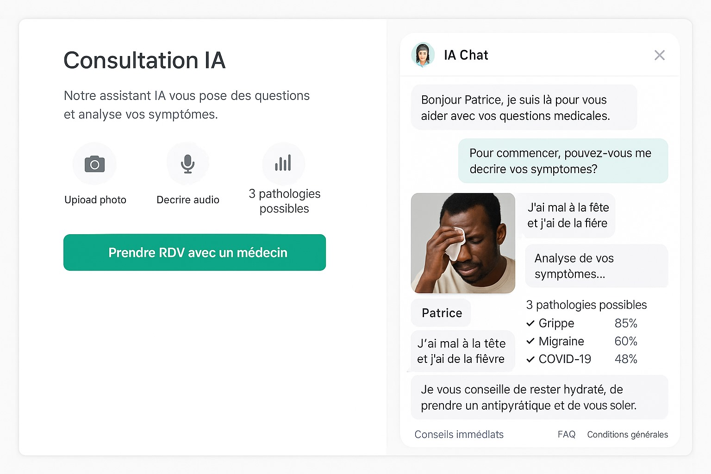

<!-- 2. Video Consultation Page -->
### 📞 Video Consultation Page


<!-- 3. Recent Diagnoses Page -->
### 📊 Recent Diagnoses Page
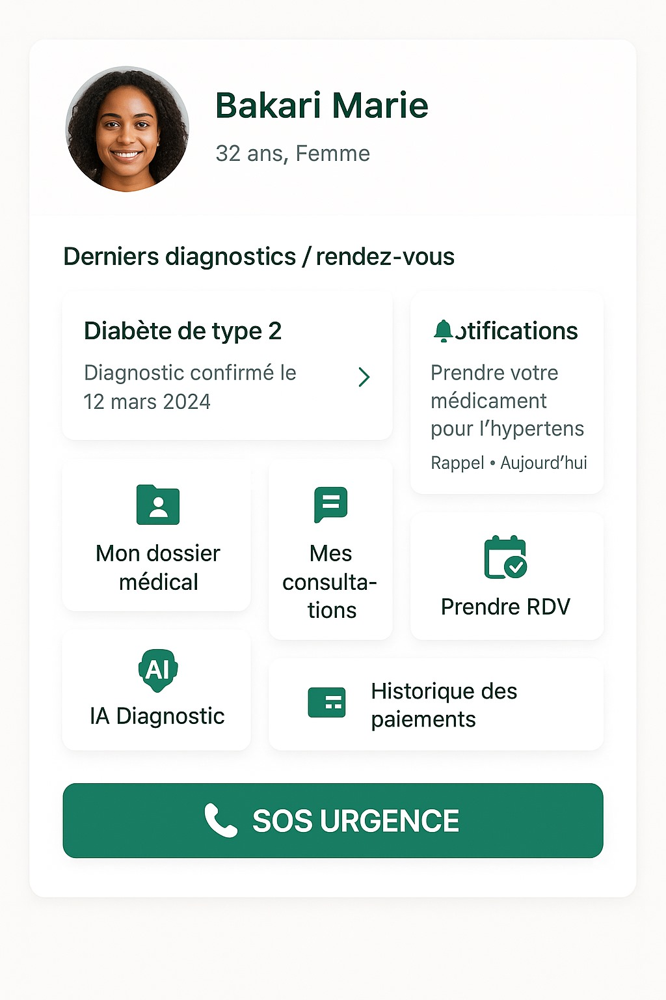

<!-- 4. Patient Profile Page -->
### 👤 Patient Profile Page
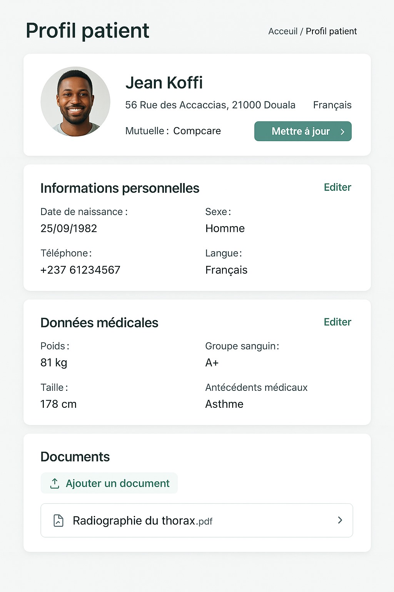

<!-- 5. Login Page -->
### 🔑 Login Page
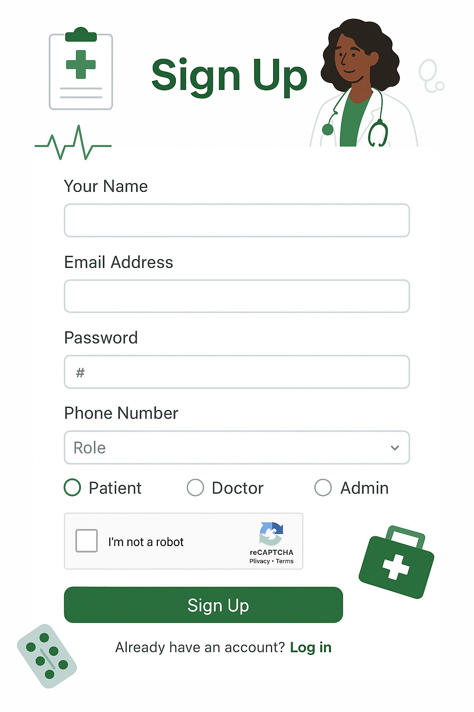

<!-- 6. Community Health Center Page -->
### 🏥 Community Health Center Page
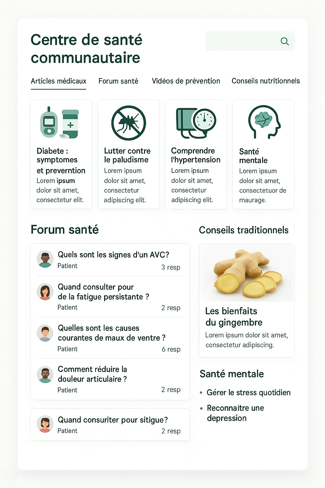

<!-- 7. Admin Space Page -->
### 🏢 Admin Space
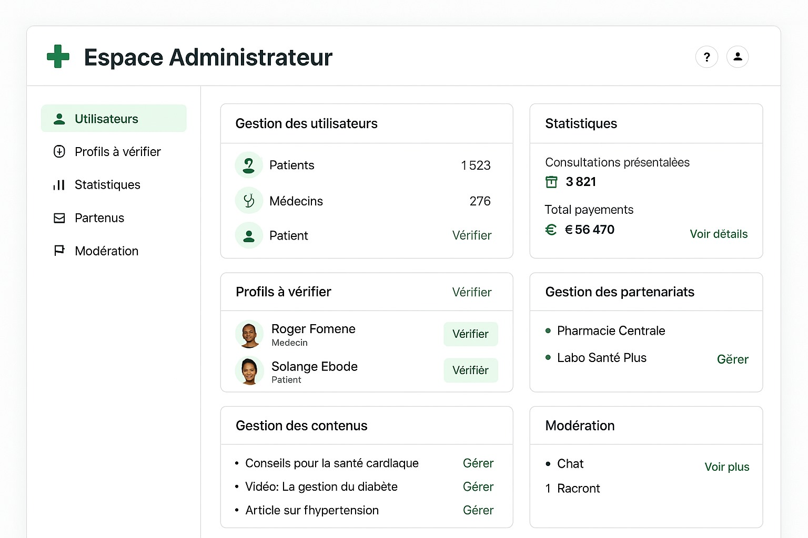

<!-- 8. Sign Up / Login Page -->
### 🔐 Sign Up / Login Page
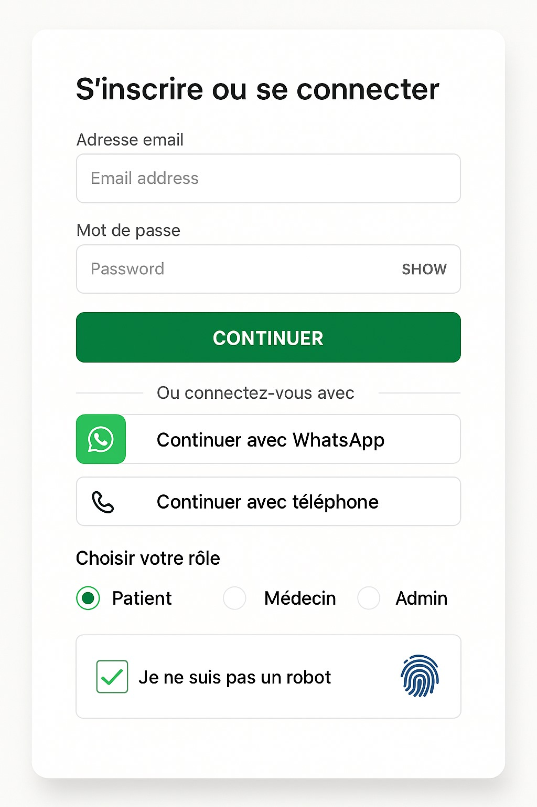

<!-- 9. Appointment Booking Page -->
### 🗓️ Appointment Booking Page
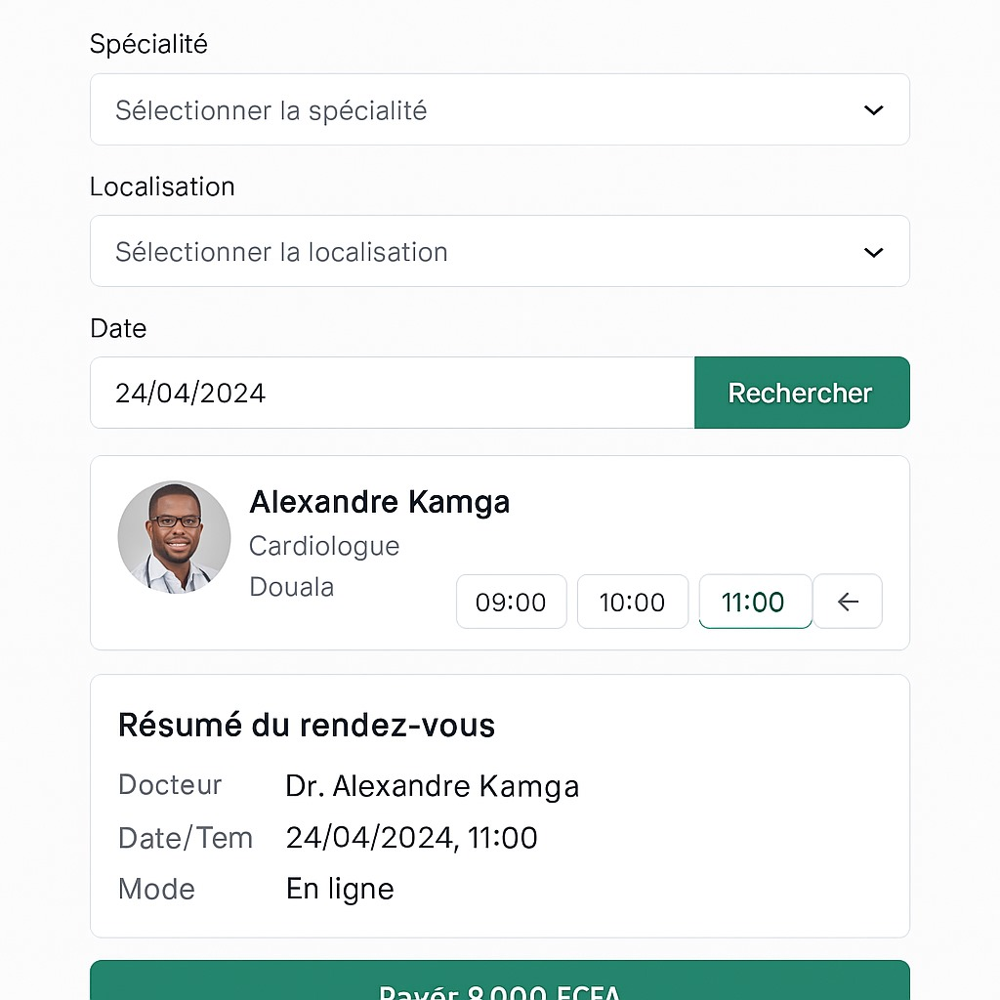

<!-- 10. Home Page -->
### 🏠 Home Page


<!-- 11. Prescription Download Page -->
### 💊 Prescription Download Page


<!-- 12. Admin Space Page -->
### 🏢 Admin Space (Duplicate for clarity)
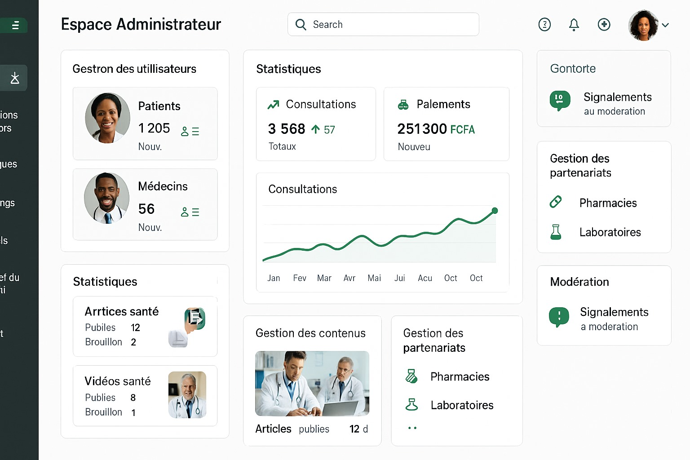

<!-- 13. Sign Up Page -->
### 📝 Sign Up Page
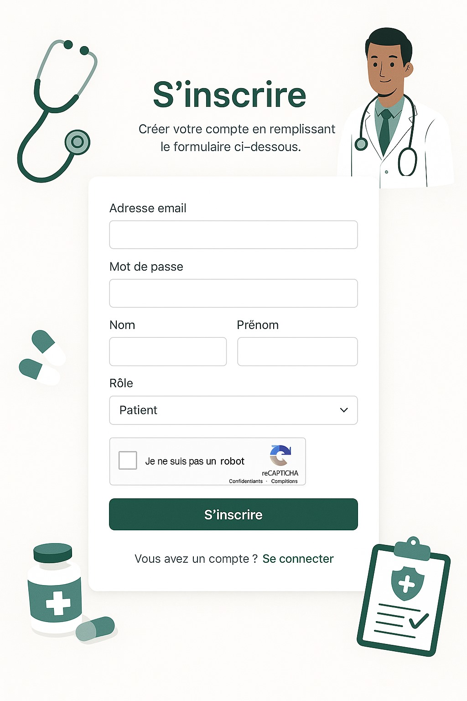

<!-- 14. Lab Analysis Page -->
### 🧪 Lab Analysis Page
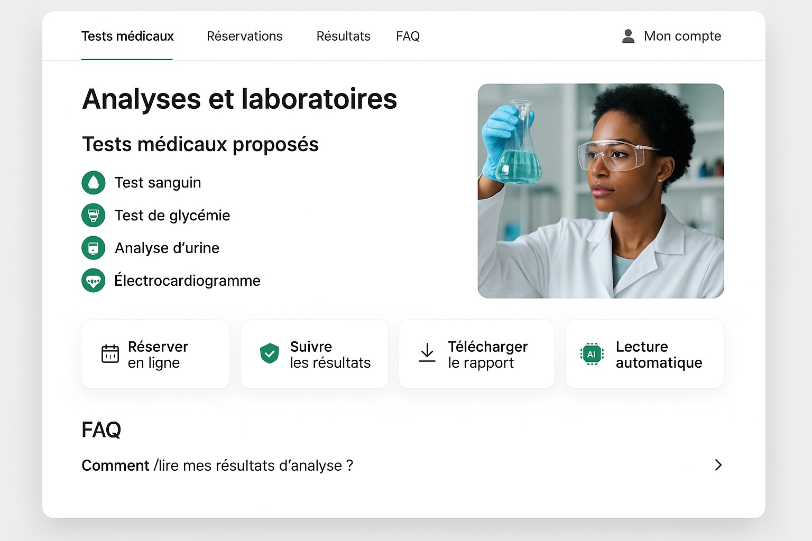

<!-- 15. Personalized Follow-Up Page -->
### 📌 Personalized Follow-Up Page
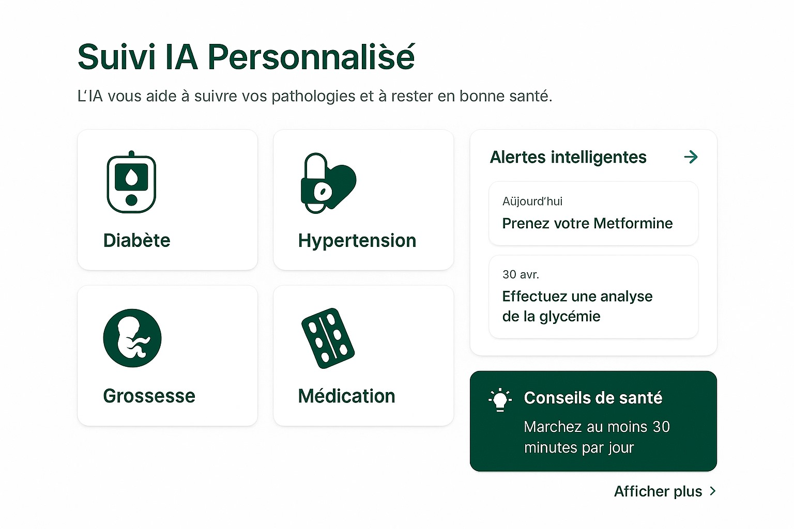

<!-- 16. Doctor Dashboard Page -->
### 👨‍⚕️ Doctor Dashboard Page
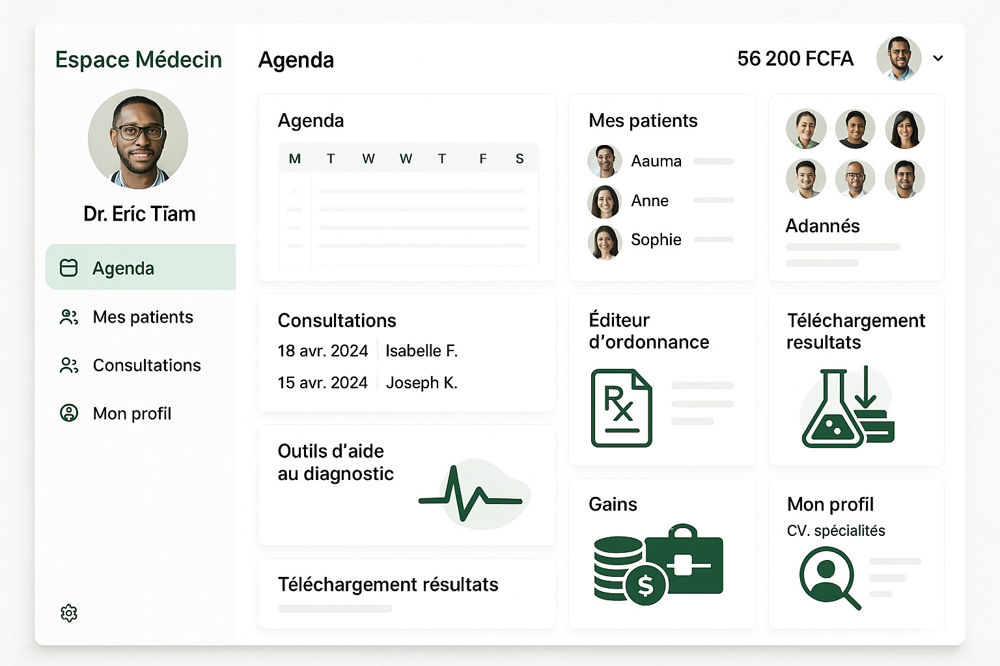

<!-- 17. Security & Confidentiality Page -->
### 🔒 Security & Confidentiality Page
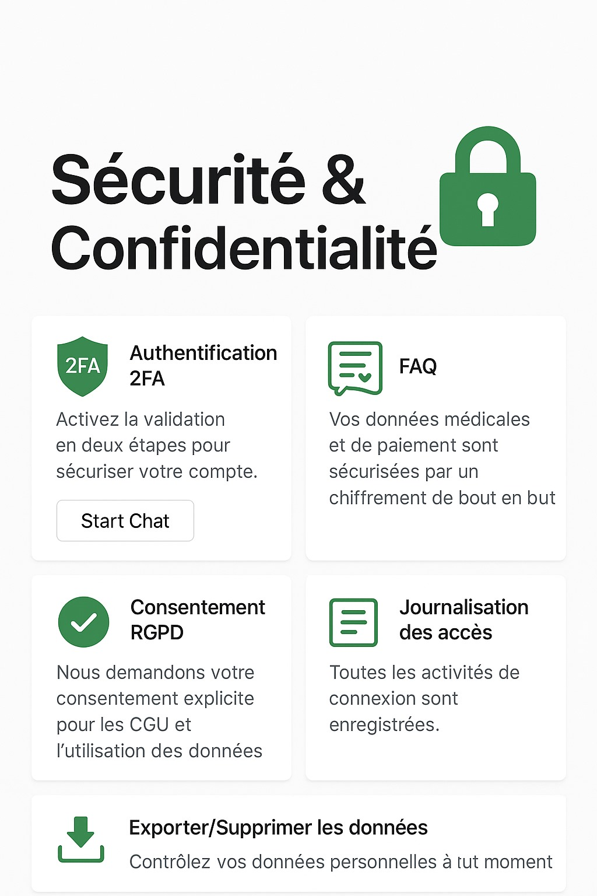


<!-- 19. User Profile Page -->
### 👥 User Profile Page


---

## 🏗️ Tech Stack

<!-- Tech stack table -->
| Frontend            | Backend           | Database       |
|---------------------|--------------------|----------------|
| React.js            | Node.js + Express | MongoDB Atlas  |
| Tailwind CSS / SCSS | REST API           | Mongoose ODM   |

---

## 📦 Project Structure

<!-- Folder structure -->
```
frontend/
├── src/
│   ├── pages/
│   ├── components/
│   └── App.js
backend/
├── controllers/
├── models/
├── routes/
├── server.js
```

---

## ⚙️ Installation

<!-- Clone repository -->
### Clone the repository
```bash
git clone https://github.com/your-username/ai-medical-platform.git
cd ai-medical-platform
```

<!-- Setup backend -->
### Setup backend
```bash
cd backend
npm install
cp .env.example .env
# Set MONGO_URI and PORT in .env
node server.js
```

<!-- Setup frontend -->
### Setup frontend
```bash
cd ../frontend
npm install
npm start
```

---

## 📡 API Endpoints

<!-- API endpoints table -->
| Method | Endpoint                     | Description              |
|--------|-------------------------------|--------------------------|
| POST   | `/api/rendezvous`            | Create a new appointment |
| GET    | `/api/rendezvous`            | Get all appointments     |
| POST   | `/api/auth/register`         | Register a user          |
| POST   | `/api/auth/login`            | User login               |

---

## 🔐 Security Features

<!-- Security features -->
- JWT Authentication
- Password hashing with bcrypt
- HTTPS enforced
- Role-based access (Admin / Doctor / Patient)

---

## 👨‍💻 Contributors

<!-- Contributors -->
- [Your Name](https://github.com/your-username)

---

## 📄 License

<!-- License -->
This project is licensed under the MIT License - see the [LICENSE](LICENSE) file for details.
